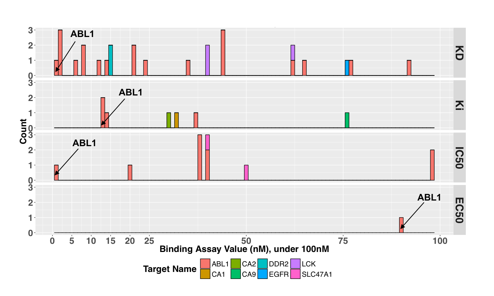

# The Cancer Targetome
A core tenet of precision oncology is the rational selection of pharmaceutical therapies 
to interact with patient-specific biological targets of interest, but it is currently 
difficult for researchers to obtain consistent and well-supported target information for 
pharmaceutical drugs. To address this gap we have aggregated drug-target interaction and 
bioactivity information for FDA-approved antineoplastic drugs across four publicly available 
resources to create the Cancer Targetome. Our work offers a novel contribution due to 
both the inclusion of putative target interactions encompassing multiple targets for each 
antineoplastic drug and the introduction of a framework for categorizing the supporting 
evidence behind each drug-target interaction.

This is an initial data release for the drug-target interactions of the Cancer Targetome. 
All drug-target interaction and bioactivity data has been aggregated from four 
publicly available resources: DrugBank, Therapeutic Targets Database, IUPHAR Guide to 
Pharmacology, and BindingDB. 

### Data Availability and Use
This work is open for public and academic research use. It is made available under the 
[Creative Commons Attribution-Non Commercial Share Alike 4.0 International License](https://creativecommons.org/licenses/by-nc/4.0/legalcode).

### Citations
The Cancer Targetome: A Critical Step Towards Evidence-Based Precision Oncology. 
Blucher, A.S., Choonoo, G., Kulesz-Martin, M., Wu, G., McWeeney, S.K. (Manuscript in preparation)

### Accessing the Data 
There are several options for accessing the Cancer Targetome data. Users interested in the data collection and aggregation
should see the Java source code, while users interested in the final aggregated drug-target interactions can find access data either 
as a mysql database dump or an abbreviated CSV file. 
*Please check back soon for the link to the complete Cancer Targetome GitHub Repository.*
#### Source Code in Java
The source code for collection and aggregation of the drug-target interaction and bioactivity data is in Java. 
#### MySQL Database Dump
The full drug-target interaction database can be downloaded as a mysql database dump. The database contains all drug-target interaction 
and bioactivity data with parent database, reference and experimental binding evidence lineage. 
#### CSV Drug-Target Interactions File
This is a file of drug-target interactions for 141 antineoplastic drugs. It also includes assigned evidence levels for each
piece of evidence supporting a drug-target interaction.  This file was used for all analysis 
and figures generated in the manuscript under preparation (indicated above).

### Example Use Case: Imatinib
In the Cancer Targetome, we aggregate drug-target interaction and bioactivity information across 
public resources for FDA-approved antineoplastic drugs. To guide prioritization of putative drug-target interactions, 
we have proposed an initial evidence framework for categorizing the supporting evidence behind each interaction. 
Briefly, we propose three levels:

Evidence Level | Description
------------ | -------------
Level I | Interaction/relationship in database with no reference information
Level II | Interaction/relationship in database with literature reference
Level III | Interaction/relationship in database with literature reference and accompanying experimental binding affinity value

Let's say we are interested in putative target interactions for imatinib, a protein kinase inhibitor. In Figure 1, we show all experimental binding affinities (Level III evidence) collected for imatinib in our aggregation process. Binding evidence is grouped according to binding assay type (EC50, IC50, Ki, or Kd). There are a total of eight different protein targets with binding affinities reported under 100nM: ABL1, CA1, CA2, CA9, DDR2, EGFR, LCK, and SLC47A1. We can see that ABL1 has the lowest scoring value (and therefore strongest binding affinity) for Kd, Ki, and IC50 assays, and is only target under 100nM for EC50 assays. We can also see that ABL1 has many assay values reported across three of the assay types, while the remaining targets have only one or two assay values reported each. 

In this manner, we can evaluate the experimental binding evidence for drug and target relationships, 
set binding affinity thresholds according to our biological question of interest, and evaluate
the strength of evidence behind a putative drug-target interaction. 

### Contact
Please contact Aurora Blucher (blucher@ohsu.edu) with questions and comments. 
