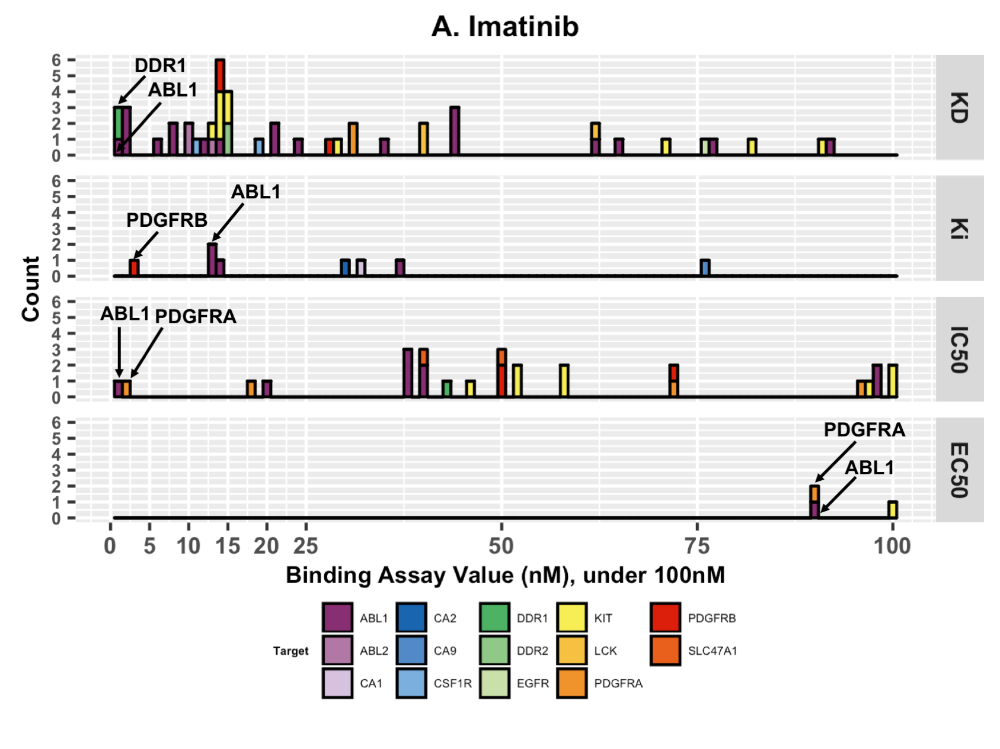

# The Cancer Targetome
A core tenet of precision oncology is the rational selection of pharmaceutical therapies 
to interact with patient-specific biological targets of interest, but it is currently 
difficult for researchers to obtain consistent and well-supported target information for 
pharmaceutical drugs. To address this gap we have aggregated drug-target interaction and 
bioactivity information for FDA-approved antineoplastic drugs across four publicly available 
resources to create the Cancer Targetome. Our work offers a novel contribution due to 
both the inclusion of putative target interactions encompassing multiple targets for each 
antineoplastic drug and the introduction of a framework for categorizing the supporting 
evidence behind each drug-target interaction.

This is an initial data release for the drug-target interactions of the Cancer Targetome. 
All drug-target interaction and bioactivity data has been aggregated from four 
publicly available resources: DrugBank [1, 2], Therapeutic Targets Database [3], IUPHAR Guide to 
Pharmacology [4], and BindingDB [5]. 

### Data Availability and Use
Contingent upon receiving permission and/or clarification from [Therapeutic Targets Database](http://bidd.nus.edu.sg/group/cjttd/), the contents of the Cancer Targetome are made available to you under the [Creative Commons Attribution Non-Commercial Share Alike 4.0 License](https://creativecommons.org/licenses/by-nc/4.0/legalcode). For commercial use, please contact us. The Cancer Targetome database is made available under the [Open Data Commons Open Database License (ODbL)](https://opendatacommons.org/licenses/odbl/1.0/). Source code is made available under the [GNU General Public License 3.0](https://opensource.org/licenses/GPL-3.0). 

### Citations
Evidence-Based Precision Oncology with the Cancer Targetome. Blucher, A.S., Choonoo, G., Kulesz-Martin, M., Wu, G., McWeeney, S.K. (Manuscript in preparation)

### Accessing the Data 
There are several options for accessing the Cancer Targetome data. Users interested in the data collection, aggregation, and assignment of evidence levels should see the Java source code, while users interested in the final aggregated drug-target interactions can find access data either as a mysql database dump or text file. 

#### Drug-Target Interactions Text File
The text file of all drug-target interactions and supporting evidence for 141 antineoplastic drugs can be found [here](https://github.com/ablucher/The-Cancer-Targetome/blob/master/results_070617/Targetome_FullEvidence_070617.txt). It includes assigned evidence levels (outlined below) for each piece of evidence supporting a drug-target interaction.  This file was used for all analysis 
and figures generated in the manuscript under preparation indicated above.

#### MySQL Database Dump
The full drug-target interaction database can be downloaded as a [mysql database dump](https://github.com/ablucher/The-Cancer-Targetome/tree/master/database). The database contains all drug-target interaction and bioactivity data with parent database, reference and experimental binding evidence lineage. 
#### Source Code in Java
The source code for collection and aggregation of the drug-target interaction and bioactivity data is in Java. 

### Example Use Case: Imatinib
In the Cancer Targetome, we aggregate drug-target interaction and bioactivity information across 
public resources for FDA-approved antineoplastic drugs. To guide prioritization of putative drug-target interactions, 
we have proposed an initial evidence framework for categorizing the supporting evidence behind each interaction. 
Briefly, we propose three levels:

Evidence Level | Description
------------ | -------------
Level I | Interaction/relationship in database with no reference information
Level II | Interaction/relationship in database with literature reference
Level III | Interaction/relationship in database with literature reference and accompanying experimental binding affinity value

Let's say we are interested in putative target interactions for imatinib, a protein kinase inhibitor. In Figure 1, we show all experimental binding affinities (Level III evidence) collected for imatinib in our aggregation process. Binding evidence is grouped according to binding assay type (EC50, IC50, Ki, or Kd). While there are a total of fourteen targets with assay evidence under 100nM, tyrosine-protein kinase ABL1 (ABL1), the canonical target of imatinib [6,7,8] notably has low nanomolar assay evidence across all four binding assay types (KD, Ki, IC50, and EC50). For KD, Ki, and IC50 assay evidence, ABL1 has multiple low nanomolar assay values, which lends more confidence to ABL1 being a biological target of the drug imatinib. Furthermore, for each of the four binding assay types, ABL1 has either the lowest or second-lowest assay value for target interactions with imatinib (Figure 3A). The case of imatinib serves as an example where evidence of the canonical “primary” target can be seen in experimental binding data. In the cases where a target other than ABL1 occupies the best or close to the best assay value (epithelial discoidin domain-containing receptor 1 (DDR1), platelet-derived growth factor alpha (PDGFRA), and platelet-derived growth factor beta (PDGFRB)), there is binding assay support from only one or two of the binding assay types rather than all four binding types, as in the case of ABL1.

*Figure 1. Imatinib Target Interactions with Binding Evidence <100nM. Colored by Target, bin width=1nM. Imatinib has experimental binding evidence for fourteen different targets under 100nM. ABL1 stands out as it has many low nanomolar assay results and it occupies the best or second best assay value for each binding assay type.*

In this manner, we can evaluate the experimental binding evidence for drug and target relationships, 
set binding affinity thresholds according to our biological question of interest, and evaluate
the strength of evidence behind a putative drug-target interaction. 
#### References
1. Wishart, D.S. (2006) DrugBank: a comprehensive resource for in silico drug discovery and exploration. Nucleic Acids Res. 34, D668–D672
2. Law, V. et al. (2014) DrugBank 4.0: shedding new light on drug metabolism. Nucleic Acids Res. 42, D1091–D1097
3. Chen, X. et al. (2002) TTD: Therapeutic Target Database. Nucleic Acids Res. 30, 412–415
4. Pawson, A.J. et al. (2014) The IUPHAR/BPS Guide to PHARMACOLOGY: an expert-driven knowledgebase of drug targets and their ligands. Nucleic Acids Res. 42, D1098–D1106
5. Gilson, M.K. et al. (2016) BindingDB in 2015: A public database for medicinal chemistry, computational chemistry and systems pharmacology. Nucleic Acids Res. 44, D1045–D1053
6. Druker, B.J. et al. (1996) Effects of a selective inhibitor of the Abl tyrosine kinase on the growth of Bcr–Abl positive cells. Nat. Med. 2, 561–566
7. Druker, B.J. et al. (2001) Efficacy and safety of a specific inhibitor of the BCR-ABL tyrosine kinase in chronic myeloid leukemia. N. Engl. J. Med. 344, 1031–1037
8. Wu, P. et al. (2015) FDA-approved small-molecule kinase inhibitors. Trends Pharmacol. Sci. 36, 422–439

### Contact
Please contact Aurora Blucher (blucher@ohsu.edu) with questions and comments. 
